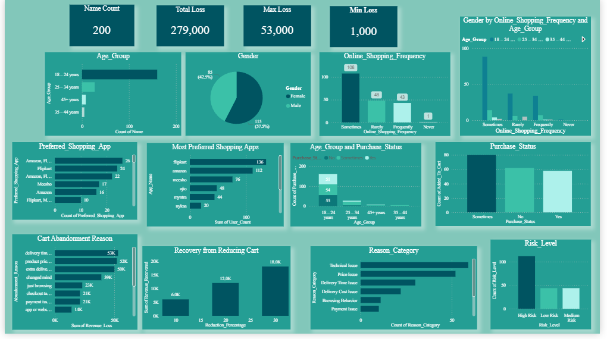

# Cart Abandonment Analysis in E-commerce

# Overview
- Analyzes customer behavior in online shopping platforms
- Focuses on identifying reasons for cart abandonment
- Estimates potential revenue loss

# Data Collection
- - Dataset collected using a Google Forms survey
- Includes:
  - Age group
  - Gender
  - Shopping frequency
  - Purchase status
  - Cart abandonment reasons

# Tools and Technologies
- Python (Pandas, NumPy)
- Jupyter Notebook
- Power BI

# Analysis Performed
- Age-wise analysis of cart abandonment
- Gender-wise purchase behavior analysis
- Identification of key abandonment reasons
- Customer risk classification (High, Medium, Low)
- Revenue loss estimation

# Key Insights
- Higher abandonment in 18–24 age group
- Major reasons:
  - High product prices
  - Delivery charges
  - Long delivery time
- Significant number of high-risk users

# Outcome
- Helps identify customer behavior patterns
- Provides insights to reduce cart abandonment
- Supports better business decision-making

# Project Files
- Python analysis code
- Dataset (survey-based)
- Power BI dashboard
- Project report

# Dashboard Preview

